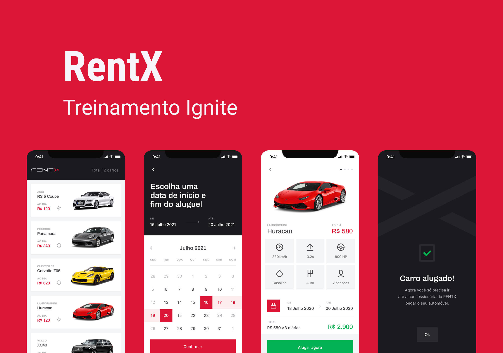

# RentX App
Projeto desenvolvido durante terceiro capítulo do treinamento Ignite da [Rocketseat.](https://www.rocketseat.com.br/)





## 🧪 Tecnologias utilizadas / Used Technologies

- [React Native](https://reactnative.dev/)
- [Typescript](https://www.typescriptlang.org/)
- [Axios](https://axios-http.com/ptbr/docs/intro)


----------------------------------------------------------------------------------------------------------

## 🚀 Como rodar o projeto / Running the project**

Clone o projeto e acesso o diretório.

```bash
$ git clone https://github.com/henriquelvieira/React-Native-Rentx.git

$ cd React-Native-Rentx

npm install
```

- Android

```
npm run android
```

- iOS

```
npm run iOS
```

----------------------------------------------------------------------------------------------------------

💻 **Autor / Author**

**Henrique Lopes Vieira**

 [](https://www.linkedin.com/in/henriquelvieira/)
 [](mailto:henrique.l.vieira92@gmail.com)